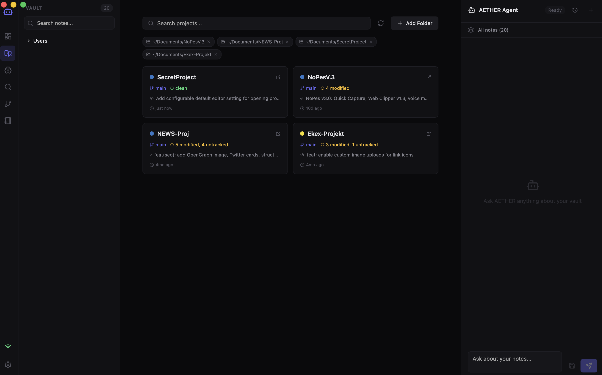

# AETHER-OS

A local-first cognitive workspace that turns your Markdown vault into an AI-powered knowledge base. Chat with your notes, run semantic search, visualize connections, and generate AI notes — all offline, all private.



## Features

- **AI Agent Chat** — Stream responses from local LLMs (Ollama) with your notes as context. Select which notes to include, or use all of them automatically.
- **Semantic Search** — Vector-based search across your vault. Index notes into embeddings and find meaning, not just keywords.
- **Knowledge Graph** — Interactive force-directed graph of wikilinks and note relationships.
- **Dashboard** — Vault statistics: note count, tasks, tags, links, and flashcards at a glance.
- **AETHER Notes** — Save AI-generated responses as persistent notes stored alongside your vault.
- **Markdown Rendering** — Full GitHub-flavored Markdown with Mermaid diagrams and media support (images, PDFs, video).
- **Resizable Panels** — Drag splitters between sidebar, main content, and AI chat to customize your layout.
- **Local-First** — No cloud, no telemetry. Your data never leaves your machine.

## Tech Stack

| Layer | Technology |
|-------|-----------|
| Desktop Framework | Tauri 2.0 |
| Frontend | React 18 + TypeScript + Vite |
| State Management | Zustand |
| Styling | Vanilla CSS with CSS variables |
| Backend | Rust |
| AI Engine | Ollama (local LLM inference) |
| Vector Store | File-based JSON embeddings |
| Icons | Lucide |
| Graph Visualization | React Flow (@xyflow/react) |

## Prerequisites

1. **Rust** — `curl --proto '=https' --tlsv1.2 -sSf https://sh.rustup.rs | sh`
2. **Node.js** 18+ — `brew install node`
3. **Ollama** — `brew install ollama` (or download from [ollama.com](https://ollama.com))

## Setup

```bash
# Install frontend dependencies
npm install

# Pull a model for the AI agent (recommended for 8GB RAM Macs)
ollama pull gemma2:2b

# For 16GB+ machines, llama3.2:3b or qwen2.5:7b are good choices
ollama pull llama3.2:3b
```

## Running

```bash
# Start Ollama in the background
ollama serve

# Launch AETHER-OS in dev mode
npm run app
```

## Building

```bash
# Build production binary
npm run app:build

# Output: src-tauri/target/release/aether-core
```

## Project Structure

```
SecretProject/
├── src/                        # Frontend (React + TypeScript)
│   ├── App.tsx                 # Main app shell with resizable panels
│   ├── main.tsx                # React entry point
│   ├── styles.css              # Global styles, themes, components
│   ├── components/
│   │   ├── AgentChat.tsx       # AI chat with context picker & streaming
│   │   ├── Dashboard.tsx       # Vault stats + note preview
│   │   ├── VaultSidebar.tsx    # File tree with folder structure
│   │   ├── VaultGraph.tsx      # Knowledge graph visualization
│   │   ├── SemanticSearch.tsx  # Vector similarity search
│   │   ├── AetherNotes.tsx     # AI-generated notes browser
│   │   ├── MarkdownRenderer.tsx# MD + Mermaid + media rendering
│   │   └── SettingsPanel.tsx   # Vault path & model settings
│   ├── lib/
│   │   ├── store.ts            # Zustand global state
│   │   └── ipc.ts              # Tauri IPC command wrappers
│   └── types/
│       └── index.ts            # Shared TypeScript types
├── src-tauri/                  # Backend (Rust)
│   ├── src/
│   │   ├── lib.rs              # Tauri app setup & command registration
│   │   ├── commands/
│   │   │   ├── vault_commands.rs   # Vault CRUD operations
│   │   │   ├── ai_commands.rs      # AI query, search, indexing
│   │   │   └── aether_note_commands.rs
│   │   └── engine/
│   │       ├── vault_reader.rs     # Markdown vault scanner & reader
│   │       ├── local_ai.rs         # Ollama API client
│   │       ├── vector_db.rs        # Embedding storage & similarity
│   │       └── aether_notes.rs     # AI note persistence
│   ├── Cargo.toml
│   └── tauri.conf.json
└── package.json
```

## Configuration

AETHER-OS stores its config at:
- **macOS**: `~/Library/Application Support/com.ekin.aetheros/`
  - `config.json` — Vault path setting
  - `vectors/` — Embedding files
  - `aether/notes/` — AI-generated notes

## Recommended Models by RAM

| RAM | Model | Command | Speed |
|-----|-------|---------|-------|
| 8 GB | Gemma 2 2B | `ollama pull gemma2:2b` | 40-50 tok/s |
| 8 GB | Llama 3.2 3B | `ollama pull llama3.2:3b` | 28-35 tok/s |
| 16 GB | Qwen 2.5 7B | `ollama pull qwen2.5:7b` | 20-25 tok/s |
| 16 GB | Llama 3.1 8B | `ollama pull llama3.1:8b` | 18-22 tok/s |

To change the model, update `DEFAULT_MODEL` in `src/components/AgentChat.tsx`.

## License

Private project.
