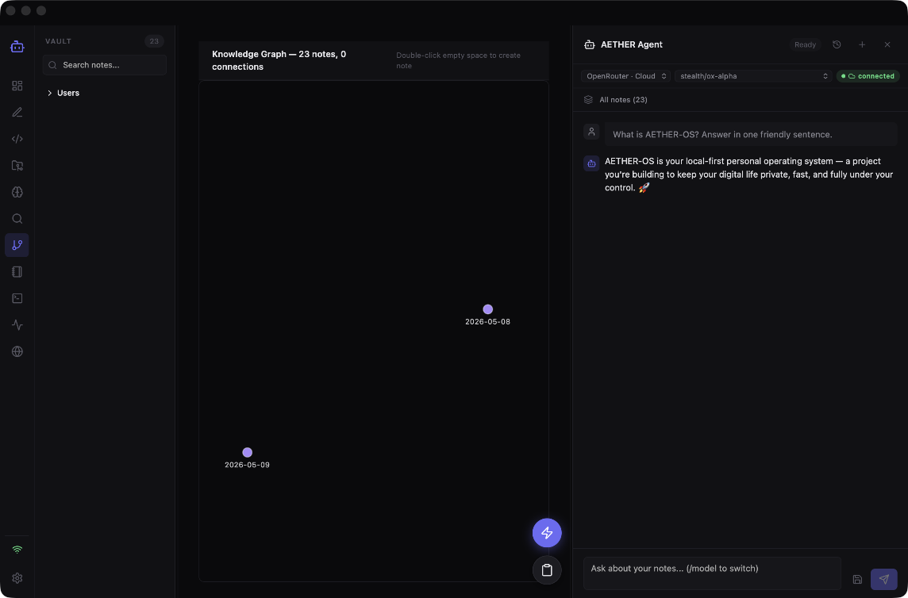

# AETHER-OS

> **A local-first personal operating system for your thoughts, your projects, and your AI.** Notes, terminal, IDE, browser, system monitor, and a multi-provider AI agent — all in one app, all on your machine, all private.



---

## What is this?

AETHER-OS is what you'd get if **Obsidian**, **VS Code**, **Warp**, **Activity Monitor**, **Safari**, and a **chat-with-your-notes AI** were designed as a single product.

It is **one app** with **eleven built-in workspaces**, all of which can talk to each other:

| # | Workspace | What it replaces |
|---|-----------|-----------------|
| 1 | **Dashboard** | The Obsidian / Notion home view |
| 2 | **Note Editor** | A split-pane Markdown editor with backlinks, slash commands, wikilink autocomplete |
| 3 | **IDE** | A VS Code-grade editor (Monaco) with file tree, multi-tab, Git source control, project-wide LSP, and an embedded terminal |
| 4 | **Projects** | A project launcher with live Git status for every configured folder |
| 5 | **Memory** | Long-term AI memory (typed facts the agent will recall forever) |
| 6 | **Semantic Search** | Vector search across the entire vault ("search by meaning, not keywords") |
| 7 | **Knowledge Graph** | A force-directed graph of every wikilink in your vault |
| 8 | **AI Notes** | A persistent library of every AI response you've ever saved |
| 9 | **Terminal** | A real `portable-pty`-backed shell with multi-tab and full ANSI support |
| 10 | **System Monitor** | Live CPU, RAM, disk, network, battery, top processes |
| 11 | **Browser** | An embedded webview with tabs, bookmarks, history — Google, YouTube, GitHub all work natively |
| 🔵 | **AI Agent** (overlay panel) | Streaming chat with your notes as context, supports local Ollama **or** cloud OpenRouter |

**Plus utilities that work everywhere:**
- ⚡ **Quick Capture** — `⌘⇧N` to drop a thought into today's daily note from anywhere.
- 🌐 **Web Clipper** — `⌘⇧C` to save any URL as a clean Markdown note in your vault.
- 🔍 **Command Bar** — `⌘K` to fuzzy-find notes, run commands, jump anywhere.
- ⚙️ **Settings** — vault path, AI provider keys, default editor, model selection.

---

## Why does this exist?

Every other tool on your computer is a **separate context**. To write a note about a bug, fix the bug, run the test, look up the docs, and ask the AI what the error means, you jump between **seven windows**. AETHER-OS is **one window** for all of it. Everything is **local-first**: your notes, your vectors, your AI — none of it leaves your machine unless you opt in to a cloud provider.

The end state is: **open one app, do everything.**

---

## ✨ Features at a glance

### Knowledge & Notes
- 📝 **CodeMirror 6 Markdown editor** with vim-like feel, syntax highlighting, live preview split-pane
- 🧠 **Wikilink autocomplete** — type `[[`, get a fuzzy-searchable picker of every note in the vault
- 🔗 **Backlinks panel** — every note shows what links to it, with a snippet and click-to-jump
- 🔍 **Unlinked Mentions** — find places that mention a note's name without the `[[…]]` syntax
- 🏷️ **Tags, daily notes, slash commands** for rapid structure
- 🖼️ **Image / PDF / video embeds** in Markdown

### AI & Search
- 🤖 **Streaming AI chat** with full Markdown + code-fence rendering
- 🎯 **Context picker** — pick which notes the agent should see, or use "all notes"
- 🧬 **Semantic search** — embeddings via Ollama (`nomic-embed-text` by default), cosine similarity ranked, % match shown
- 🧠 **Persistent AI memory** — store facts ("Ekin prefers dark mode", "Project X is in TypeScript") and the agent will recall them across sessions
- 💾 **Save-as-AETHER-Note** — convert any AI answer into a permanent note
- 🔌 **Multi-provider**:
  - **Ollama** (default, fully local)
  - **OpenRouter** (Claude, GPT-4o, Gemini, Qwen, Llama, etc.) — key is stored in the app's private data directory, never in your browser or vault

### Workspace / OS
- 💻 **Embedded IDE** — Monaco editor, file tree with chevron expand, multi-tab, real `portable-pty` terminal at the bottom
- 🌳 **Git source control** in the IDE — branch, status, stage/unstage, commit, push/pull, diff viewer
- 🧠 **Project-wide LSP** — TypeScript language server runs as a sidecar, gives you hover / completions / go-to-definition / red squigglies across the whole project
- 🖥️ **System Monitor** — live CPU, RAM, disk, network, battery, top processes (uses `sysinfo` in Rust)
- 🌐 **Embedded browser** — real WebKit webview, tabs, bookmarks, history, you can read and sign into anything
- 🐚 **Multi-tab terminal** with real PTY streaming

### Capture & Workflow
- ⚡ **Quick Capture** — `⌘⇧N` to drop a thought into today's daily note without leaving whatever you're doing
- 🌐 **Web Clipper** — `⌘⇧C`, paste a URL, get a clean Markdown note in the vault
- 🔍 **Command Bar** — `⌘K` for fuzzy search across everything
- ⌨️ **Keyboard-first** — almost every action has a shortcut
- 💾 **Autosave** — never lose work; edits save 1s after the last keystroke

---

## 🚀 Quick start

### Prerequisites
1. **Rust** → `curl --proto '=https' --tlsv1.2 -sSf https://sh.rustup.rs | sh`
2. **Node.js 18+** → `brew install node`
3. **Ollama** (only if you want local AI) → `brew install ollama`

### Install
```bash
git clone <your-fork-url> aether-os
cd aether-os
npm install
```

### Run in dev mode
```bash
# Terminal 1: start Ollama in the background (skip if you'll only use OpenRouter)
ollama serve

# Terminal 2: launch the app
npm run app
```

The first time it boots it will:
- Auto-detect or ask you to pick a **vault folder** (a directory of `*.md` files).
- Show **Ollama offline** in the corner if the daemon isn't running — that's fine, the rest of the app still works.

### Pull a model (optional, for local AI)
```bash
# 8GB RAM
ollama pull gemma2:2b

# 16GB+ RAM
ollama pull llama3.2:3b
ollama pull qwen2.5:7b

# For semantic search embeddings
ollama pull nomic-embed-text
```

### Use a cloud model (optional)
1. Open the app.
2. Click the **gear icon** in the bottom-left to open Settings.
3. Paste your **OpenRouter API key** in the "OpenRouter API Key" field. Click **Save Key**, then **Test** to verify.
4. In the AI chat panel, switch the provider from `Ollama · Local` to `OpenRouter · Cloud` and pick any of 100+ models (Claude, GPT-4o, Gemini, etc.).

---

## 📖 Full tutorial

**The single most useful file in this repo** is [`docs/TUTORIAL.md`](docs/TUTORIAL.md). It walks you through every single workspace with a screenshot, explains *what each thing is*, *why it exists*, *how to use it*, and *how to get good at it*. Written to be understood by a 6-year-old. About 90 minutes from start to "I know everything this app can do."

---

## 🏗️ Architecture

| Layer | Technology | Where |
|------|-----------|-------|
| Desktop shell | **Tauri 2** | `src-tauri/` |
| Frontend | **React 18 + TypeScript + Vite** | `src/` |
| State | **Zustand** | `src/lib/store.ts` |
| Note editor | **CodeMirror 6** | `src/components/NoteEditor.tsx` |
| IDE editor | **Monaco** | `src/components/IdeView.tsx` |
| Terminal renderer | **xterm.js** | `src/components/Terminal.tsx` |
| Web clipper / fetch | `reqwest` (Rust) + `scraper` | `src-tauri/src/engine/web_clipper.rs` |
| PTY backend | `portable-pty` | `src-tauri/src/engine/terminal.rs` |
| Browser | Native **WKWebView** (Tauri) | `src/components/Browser.tsx` |
| System metrics | `sysinfo` (Rust) | `src-tauri/src/commands/monitor_commands.rs` |
| Git | `git2` (libgit2 bindings) | `src-tauri/src/commands/git_commands.rs` |
| LSP client | `lsp-types` (Rust) + sidecar | `src-tauri/src/engine/lsp.rs` |
| Local AI | `reqwest` → Ollama HTTP API | `src-tauri/src/engine/local_ai.rs` |
| Cloud AI | `reqwest` → OpenRouter | `src-tauri/src/engine/cloud_ai.rs` |
| Vector store | File-based JSON (`nomic-embed-text`) | `src-tauri/src/engine/vector_db.rs` |
| Markdown | `markdown-rs` + `pulldown-cmark` | `src-tauri/src/engine/markdown_render.rs` |
| Diagrams | `mermaid`, `cytoscape`, `katex` | bundled JS |
| Icons | `lucide-react` | npm |

### Backend command surface
The Rust side exposes **79 Tauri commands** grouped by domain. Highlights:

| Domain | Commands |
|---|---|
| Vault | `cmd_get_vault_path`, `cmd_set_vault_path`, `cmd_get_vault_notes`, `cmd_get_note_content`, `cmd_write_note`, `cmd_delete_note`, `cmd_get_vault_index`, `cmd_get_vault_graph`, `cmd_get_vault_stats`, `cmd_index_vault` |
| AI | `cmd_agent_query`, `cmd_agent_query_with_notes`, `cmd_save_aether_note`, `cmd_list_aether_notes`, `cmd_semantic_search`, `cmd_get_ai_config`, `cmd_set_ai_provider`, `cmd_set_ai_model`, `cmd_test_ai_connection` |
| Memory | `cmd_memory_add_fact`, `cmd_memory_list_facts`, `cmd_memory_delete_fact`, `cmd_memory_list_conversations`, `cmd_memory_load_conversation` |
| IDE | `cmd_ide_set_root`, `cmd_ide_list_files`, `cmd_ide_read_file`, `cmd_ide_write_file`, `cmd_ide_git_status`, `cmd_ide_git_stage`, `cmd_ide_git_commit`, `cmd_ide_git_diff`, `cmd_ide_git_log` |
| Terminal | `cmd_terminal_create`, `cmd_terminal_write`, `cmd_terminal_resize`, `cmd_terminal_kill`, `cmd_terminal_list` |
| Browser | `cmd_browser_open`, `cmd_browser_navigate`, `cmd_browser_go_back`, `cmd_browser_go_forward`, `cmd_browser_bookmark_*` |
| System | `cmd_system_metrics`, `cmd_system_processes`, `cmd_system_kill` |
| Clipper | `cmd_clip_url`, `cmd_clip_save_to_vault` |
| LSP | `cmd_lsp_start`, `cmd_lsp_hover`, `cmd_lsp_completion`, `cmd_lsp_definition`, `cmd_lsp_diagnostics` |
| Projects | `cmd_projects_list`, `cmd_projects_add`, `cmd_projects_remove` |

Full type-safe surface is in `src/lib/ipc.ts` (one wrapper per command).

---

## 🧪 Tests

```bash
npm test          # 90 unit tests across 7 files
npm run build     # TypeScript + Vite production build
cargo test --manifest-path src-tauri/Cargo.toml
```

Coverage focuses on: state store invariants, IDE store, LSP protocol parser, Git view model, clipper extractor, panel drag geometry, and the terminal component.

---

## 📁 Where your data lives

| Data | Path (macOS) |
|------|-------------|
| App config | `~/Library/Application Support/com.ekin.aetheros/config.json` |
| Vector embeddings | `~/Library/Application Support/com.ekin.aetheros/vectors/` |
| AI-saved notes | `~/Library/Application Support/com.ekin.aetheros/aether/notes/` |
| AI memory | `~/Library/Application Support/com.ekin.aetheros/memory/facts.json` |
| Conversation history | `~/Library/Application Support/com.ekin.aetheros/memory/conversations/` |
| Session database | `~/Library/Application Support/com.ekin.aetheros/aether.sqlite` |
| Auth keys | `~/Library/Application Support/com.ekin.aetheros/auth.json` |
| **Your notes** (vault) | wherever you point it (default: `~/Documents/NopeVault`) |

**Privacy:** nothing leaves your machine unless you type into a cloud AI provider. The vault is plain `.md` files on disk; even if AETHER-OS disappeared tomorrow, your notes would still open in any text editor.

---

## 🤝 Contributing

PRs welcome. The codebase has a clear separation:
- New workspace = new `src/components/<Name>.tsx` + 1 entry in `App.tsx`'s view router.
- New backend feature = new Tauri command in `src-tauri/src/commands/` + wrapper in `src/lib/ipc.ts`.
- Add a Vitest test next to the file you're changing.

---

## 📜 License

Private project. Not yet open-sourced.
