# AETHER-OS — The Complete Tutorial

> **Everything this app can do, explained like you're six.** One section per workspace and per utility: what it is, why it exists, how to use it, and the keys that make it fast. Screenshots come from the browser preview (`npm run dev:mock`) with its demo vault, so you can follow along without installing anything.

Shortcuts are written for macOS (⌘ = Command, ⌥ = Option, ⇧ = Shift). On Windows and Linux, ⌘ is Ctrl.

---

## Table of contents

1. [What is AETHER-OS?](#1-what-is-aether-os)
2. [First launch — the setup wizard](#2-first-launch--the-setup-wizard)
3. [The shell — rail, titlebar, status bar, themes](#3-the-shell--rail-titlebar-status-bar-themes)
4. [Home](#4-home)
5. [Notes — the editor](#5-notes--the-editor)
6. [Launcher (⌘K) and Universal Search](#6-launcher-k-and-universal-search)
7. [Graph](#7-graph)
8. [AI Notes](#8-ai-notes)
9. [Memory](#9-memory)
10. [History — every version of every note](#10-history--every-version-of-every-note)
11. [Export & Publishing](#11-export--publishing)
12. [IDE](#12-ide)
13. [Projects](#13-projects)
14. [Terminal](#14-terminal)
15. [Calendar](#15-calendar)
16. [Tasks — project boards](#16-tasks--project-boards)
17. [Note Tasks — checkboxes from every note](#17-note-tasks--checkboxes-from-every-note)
18. [Monitor](#18-monitor)
19. [Browser](#19-browser)
20. [Clipboard](#20-clipboard)
21. [Plugins](#21-plugins)
22. [Sync & Backup](#22-sync--backup)
23. [The AI agent — context, actions, approvals, compaction](#23-the-ai-agent--context-actions-approvals-compaction)
24. [Focus mode & Pomodoro](#24-focus-mode--pomodoro)
25. [Pins](#25-pins)
26. [Quick Capture](#26-quick-capture)
27. [Web Clipper](#27-web-clipper)
28. [Settings](#28-settings)
29. [Keyboard shortcuts cheat-sheet](#29-keyboard-shortcuts-cheat-sheet)
30. [Where your data lives](#30-where-your-data-lives)
31. [Power-user tips](#31-power-user-tips)
32. [Troubleshooting](#32-troubleshooting)

---

## 1. What is AETHER-OS?

AETHER-OS is **one app** for the things you do all day at a computer:

- a **note app** like Obsidian (plain Markdown files, wikilinks, backlinks, daily notes),
- a **launcher** like Raycast/Spotlight that finds notes, files, apps, events, tasks and commands,
- an **AI agent** that answers from your notes and can act on them — with your approval for anything risky,
- a **code editor** (Monaco, the VS Code editor) with Git and language servers, and a real **terminal**,
- a **calendar**, **project boards** and a **task list built from your notes' checkboxes**,
- a **clipboard history**, **note versioning**, **encrypted sync and backups**, **export to HTML/PDF/website**, and **plugins**.

Everything runs on your machine. Your notes stay plain `.md` files in a folder you choose. Nothing leaves the computer unless you pick a cloud AI model, publish something, or sync through a folder you control.

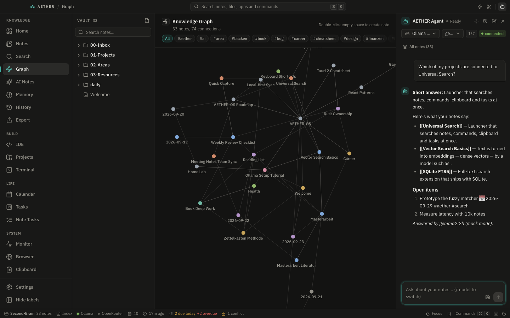

### What it is NOT

- **Not a cloud product.** There is no account and no server. Sync works through a folder you already sync (iCloud Drive, Dropbox, Syncthing …) and is end-to-end encrypted.
- **Not Electron.** It is built on Tauri 2: the system WebKit for the UI and Rust for everything privileged.
- **Not finished.** v0.2 is the first release where every workspace is complete; see the [changelog](../CHANGELOG.md).

---

## 2. First launch — the setup wizard

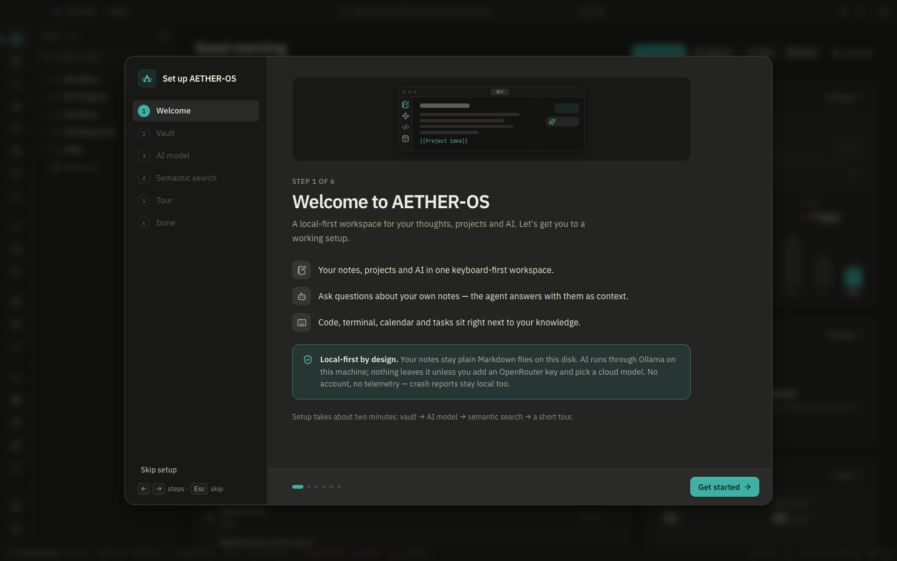

**What.** A six-step wizard that gets you from zero to a working setup in about two minutes: **Welcome → Vault → AI model → Semantic search → Tour → Done**.

**Why.** AETHER-OS needs three things to shine — a vault, a local model and an embedding index. The wizard makes each one visible and fixes it with one click instead of letting you discover them through errors.

**How.**

1. **Vault** — pick one of the detected vaults (Obsidian, NoPes or any folder with Markdown files in `~/Documents` or `~`), *Choose a folder…*, or *Create a new vault*. A new vault comes with a Welcome note, a README about links, tags and tasks, today's daily note, `Projects/Getting started.md` and a Markdown cheat sheet.
2. **AI model** — shows whether Ollama is running (with copyable install/start commands if not), recommends a model for your RAM (`llama3.2:1b` under 8 GB, `llama3.2:3b` under 16 GB, `qwen2.5:7b` under 32 GB, `qwen2.5:14b` above) and downloads it with live progress. Or paste an OpenRouter key instead.
3. **Semantic search** — downloads the embedding model (`nomic-embed-text` by default; another one can be chosen later in Settings → AI Providers) and indexes the vault so search and the agent can find notes by meaning.
4. **Tour** — six cards (launcher, quick capture, agent, IDE, terminal, calendar/tasks) with the real shortcuts. *Try it* pauses the wizard and runs the command; a "Resume setup" pill brings you back.
5. **Done** — a summary, the opt-in for a daily update check, and *Open Home*.

**Keys.** ← / → move between steps, ⌘↵ continues, Esc asks whether to skip. Everything can be skipped and re-run later: ⌘K → *Help: run setup again*, or Settings → General.

Downloads keep running in the background if you close the wizard; progress shows up wherever the model is mentioned.

---

## 3. The shell — rail, titlebar, status bar, themes

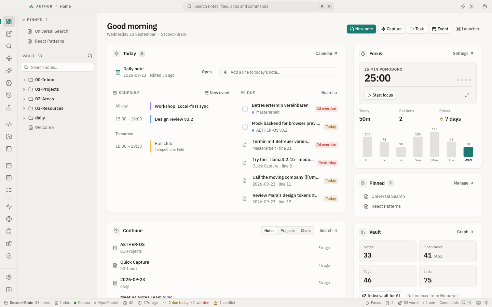

**The navigation rail** (left) holds all nineteen workspaces in four groups — **Knowledge** (Home, Notes, Search, Graph, AI Notes, Memory, History, Export), **Build** (IDE, Projects, Terminal), **Life** (Calendar, Tasks, Note Tasks) and **System** (Monitor, Browser, Clipboard, Plugins, Sync & Backup). Hover an icon for its name and shortcut; **⌘\\** (or *Show labels* at the bottom) expands the rail with group headings, as in the first screenshot. ⌘1 … ⌘9 jump to the first nine workspaces. Settings sits at the bottom of the rail.

**The vault sidebar** (next to the rail) shows your **Pinned** items on top ([§25](#25-pins)) and the note tree below, with a filter field and a *New note* button. Drag its edge to resize. The IDE hides it because it has its own file tree.

**The titlebar** shows where you are (`AETHER / Home`), the **command pill** in the middle (click it or press ⌘K) and three buttons on the right: Quick Capture, Web Clipper and the AI agent panel.

**The status bar** (bottom) is a live dashboard. From left to right: the vault and its note count, the embedding **Index** button, Ollama and OpenRouter status, clipboard count, time of the last history snapshot, note tasks due today / overdue, sync state; on the right the Pomodoro timer (**Focus**), the pins drawer, "N related" and a word count while editing, **Commands ⌘K**, the shortcuts overlay (⌘/) and the theme toggle. Click any item to jump to its feature.

**Themes.** Light, dark, or follow the system: ⇧⌘L toggles, the sun/moon in the status bar too. Settings → Appearance adds four accent colours (Teal, Ember, Cobalt, Graphite) and a compact density. The terminal, Monaco, the graph, charts and mermaid diagrams all follow the theme.

**Keyboard-first.** Every primary action is a command with a shortcut. ⌘/ shows them all; Settings → Shortcuts lets you search them and copy a Markdown cheat sheet (see [§29](#29-keyboard-shortcuts-cheat-sheet)).

---

## 4. Home

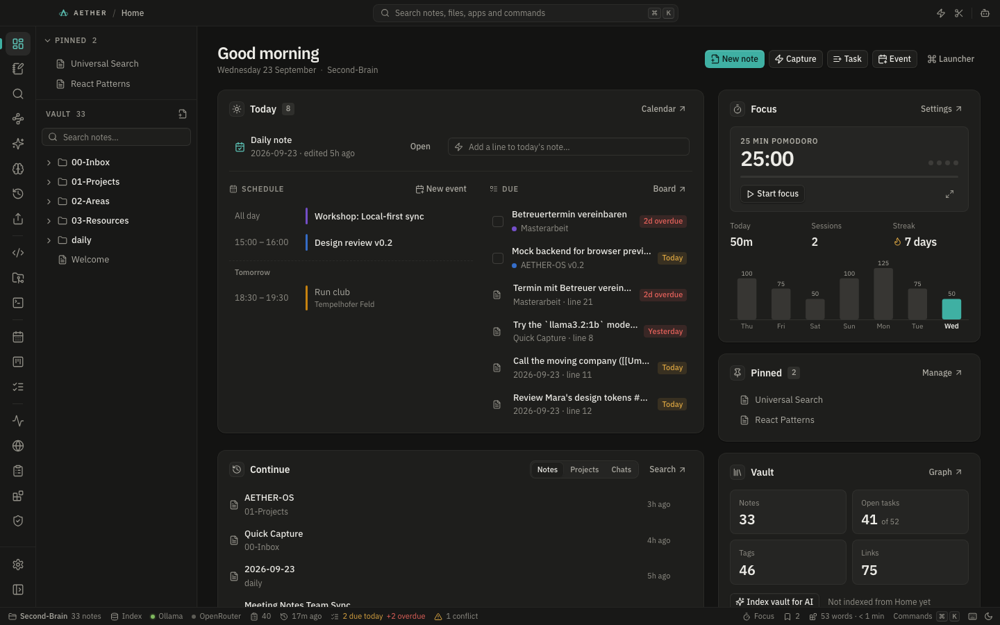

**What.** The first workspace (⌘1): a morning briefing built from your vault, calendar, tasks and focus log.

**Why.** The old dashboard showed counters. Home answers the questions you have when you sit down: *what is on today, what is overdue, what was I working on, what do I keep coming back to, and am I focusing?*

**How.** On wide windows Home is a 65/35 layout; on narrow ones a single column.

| Block | What it shows |
| --- | --- |
| Header | Greeting, date, vault name and quick actions: **New note** (⌘N), **Capture** (⇧⌘N), **Task**, **Event**, **Launcher** (⌘K) |
| Today | Today's daily note (*Open* / *Create*) with a one-line capture field; **Schedule** — today's and tomorrow's events; **Due** — board tasks due today or earlier (tick to complete) and open checkbox tasks from notes |
| Continue | Recent **Notes**, **Projects** (branch + git status) and **Chats**; every row has a pin button |
| Focus | Pomodoro timer, today's minutes, sessions, streak and a 7-day chart ([§24](#24-focus-mode--pomodoro)) |
| Pinned | Your pin groups ([§25](#25-pins)) |
| Vault | Notes, open tasks, tags and links; **Index vault for AI** with progress and the last run |

Every block loads on its own: if one source fails, only that block shows an error.

**Getting good at it.** Open Home first thing, tick off what is done, pin the three notes you use daily, and start a Pomodoro before you open anything else. ⌘K → *Home: open today's daily note* works from anywhere.

---

## 5. Notes — the editor

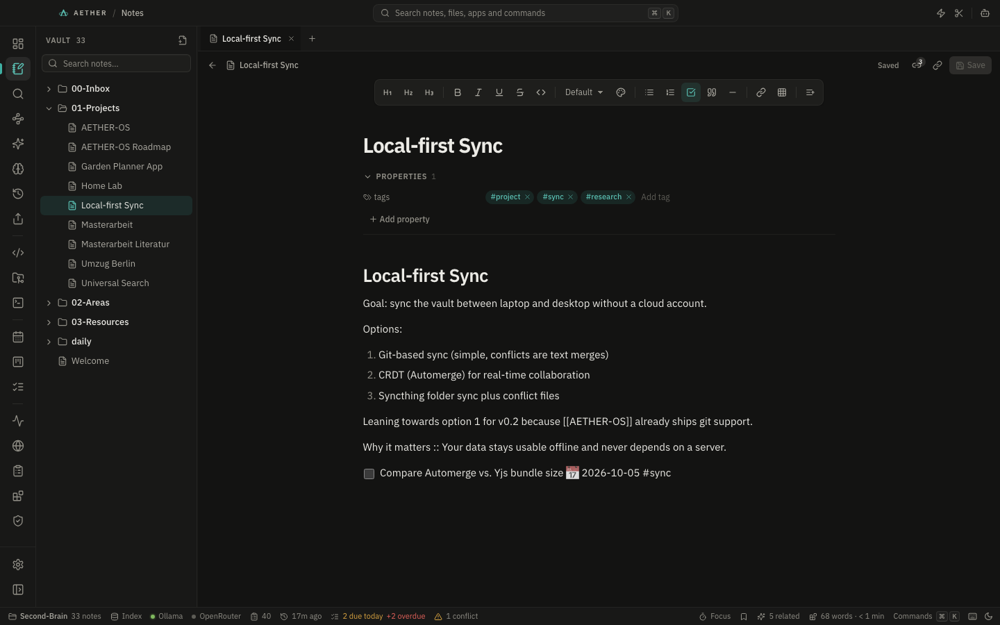

**What.** A tabbed WYSIWYG Markdown editor (TipTap/ProseMirror). What you see is formatted; what is saved is plain Markdown.

**Why.** Writing is the core loop: capture → edit → link → recall. The editor keeps the file format portable (Obsidian opens the same files) while being pleasant to type in.

**How.**

- **Open a note** from the vault sidebar, the launcher (⌘K), Home, search results or the graph. Each note opens in a **tab**; `+` creates a new note (⌘N from anywhere).
- **Toolbar**: H1–H3, bold (⌘B), italic (⌘I), underline (⌘U), strikethrough, inline code, text size, colour, bullet / numbered / task lists, quote, divider, link, table, and *Add property*.
- **Properties**: a note's YAML front matter (`tags`, `status`, `source` …) is shown as a compact panel of key/value rows above the text instead of inside it. Click a value to edit it (↵ saves, Esc reverts), add or remove tags as chips, add or remove properties; the panel collapses. Only the edited YAML line changes and the note body stays byte for byte as it was; YAML the panel cannot display is shown read-only and kept unchanged.
- **Wikilinks**: type `[[` and pick a note. The autocomplete searches note names, folders and initials as you type (`[[rp` finds *React Patterns*); ↑/↓ select, ↵ or Tab inserts the link, Esc closes, and the last row, *Create note “…”*, creates the note and links it. Typing or pasting a complete `[[Note name]]` works too; `[[Note#Heading]]`, `[[Note|alias]]` and `![[Note]]` are understood. Links show as chips: click one (or select it and press ↵) to open the note — a `#heading` link scrolls to the heading, a link to a note that does not exist yet (shown dashed) creates it. Double-click a chip to edit its text. Links feed backlinks, the graph, related-note suggestions and exports.
- **Images and media**: `` and Obsidian-style `![[file.png|300]]` images show in the editor; other `![[…]]` embeds show as a chip. Everywhere notes are rendered as Markdown — the Search preview, AI Notes, exports — images, video, audio and PDFs embedded as `` or Obsidian-style `![[file.png|300]]` (optional width, or `300x200`) render too. Paths are resolved relative to the note, then the vault root, then `attachments/` or `assets/` folders next to the note or above it; files stay in the vault (loaded through Rust, up to 25 MB). Web images in AI answers and plugin panels are not fetched until you click *Load*, so they cannot track you.
- **Backlinks** (link icon with a count, top right): every note that links here, with the line in context. **Unlinked mentions**: places that name this note without `[[…]]`, with one-click linking.
- **Autosave**: the note is written 1.2 s after your last keystroke, and immediately when you switch notes or views. The header shows *Saving… / ● Unsaved / Saved*; ⌘S saves right away.
- **Every save is a version** (if History is on): ⇧⌘H opens the note's history in a drawer ([§10](#10-history--every-version-of-every-note)).
- **Related notes** (⇧⌘R, or "N related" in the status bar): suggestions to link and tags to add ([§23](#23-the-ai-agent--context-actions-approvals-compaction)).
- **Raw Markdown**: ⌘K, find the note, **⌘↵** opens it as source in the IDE. Saving from the editor rewrites only the lines you edited; everything else keeps its exact bytes, and Obsidian syntax — `[[links]]`, `![[embeds]]`, `#tags`, `==highlights==`, `%%comments%%`, `$math$`, footnotes, callouts, HTML comments — is saved exactly as written. Math and comments show as their source; double-click one to edit it.

**Tips.** Link the first mention of every concept to its own note; after a few weeks the graph and the related-notes drawer start doing the linking for you.

---

## 6. Launcher (⌘K) and Universal Search

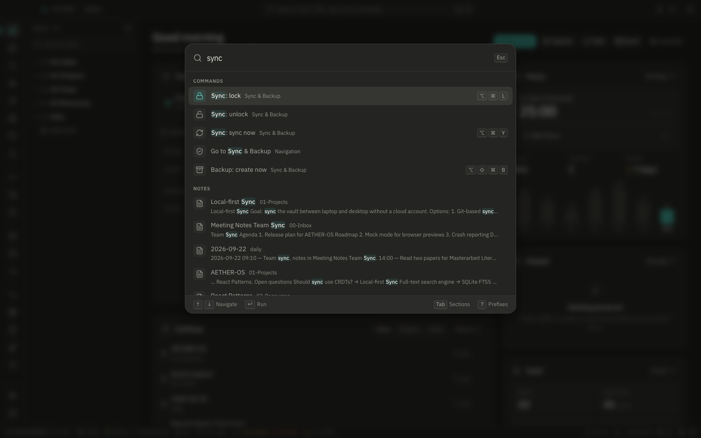

**What.** One input for everything AETHER-OS knows: commands, notes (title and content), projects, project files, installed apps, calendar events, tasks, memory facts, AI conversations, browser bookmarks and clipboard items. It replaces the v0.1 command bar.

**Why.** Switching views to find something breaks flow. Two keystrokes should reach any note, file, app or action.

**How.**

- **⌘K** opens it inside the app; **⌥Space** opens it from anywhere on the Mac (change or disable the global shortcut in Settings → Search). ⌘P opens it in *Go to file* mode, ⇧⌘P in *Run a command* mode.
- With an empty query you see **Recent** items and all commands. While you type, results are grouped: Commands → Notes → Projects → Files → Apps → Events → Tasks → Memory → Conversations → Bookmarks → Clipboard.
- **Prefixes**: `>` commands only, `#` tags, `/` files and notes by path, `@` people & memory, `?` lists the prefixes.
- **Keys**: ↑/↓ select, Tab / ⇧Tab jump between sections, ↵ opens, **⌘↵ opens in the alternate place** (a note as raw Markdown in the IDE, a project in your external editor, an event in week view …), Esc clears or closes.
- Ranking combines keywords (SQLite FTS5), fuzzy titles (`clbrd` finds *Clipboard*) and how often and how recently you opened something.

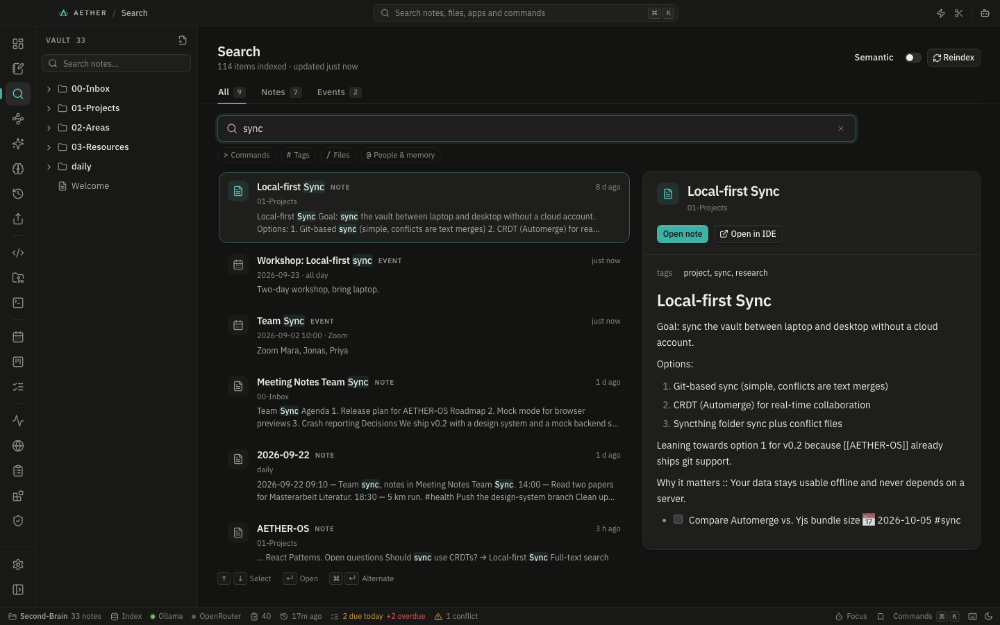

**Universal Search** is the full-page version (the *Search* workspace, ⌘3 or ⇧⌘K): category tabs with counts, highlighted snippets, a **preview pane** (rendered note, event details, conversation transcript, first lines of a code file) and a **Semantic** switch that adds results found by meaning from the vector index. **Reindex** rebuilds the whole index and reports what it found.

**Settings → Search**: the global shortcut, which kinds to search (with document counts), which folders to index for files (default: your projects; only names and paths, never file contents, and `.gitignore` is respected), and *Clear recents*.

---

## 7. Graph

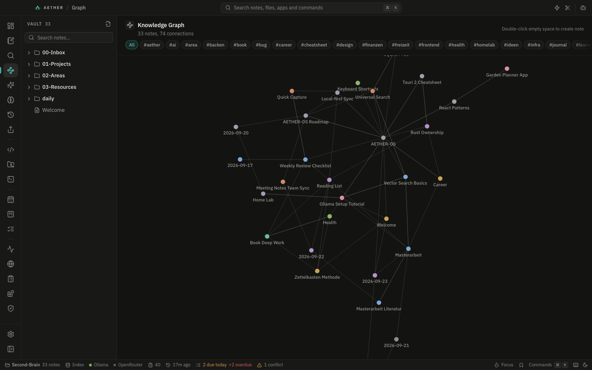

**What.** A force-directed map of your vault (⌘4): every note is a dot, every `[[wikilink]]` a line. The header counts notes and connections; tag chips filter the graph.

**Why.** Structure you cannot see is structure you do not use. Hubs are your load-bearing notes, bridges are where two ideas meet, lonely dots are thoughts waiting for a link.

**How.** Click a dot to open the note, drag to rearrange, scroll to zoom, drag the background to pan, **double-click empty space to create a new note**. The canvas follows the light/dark theme.

---

## 8. AI Notes

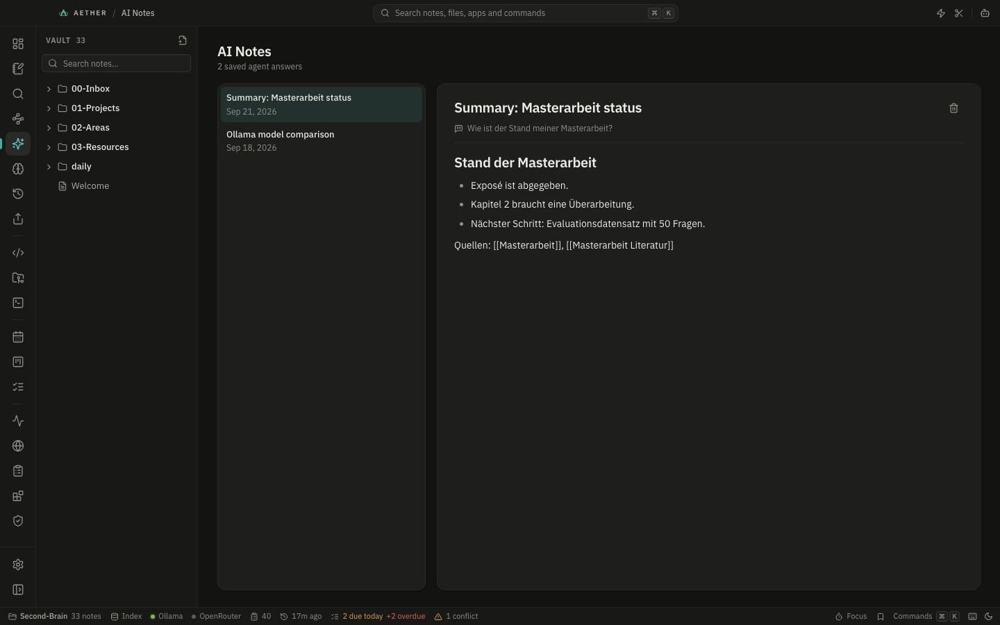

**What.** The library of agent answers you chose to keep (⌘5). The list shows title and date; the right side renders the answer with the question that produced it and the notes it had as context.

**Why.** Good answers are worth keeping without cluttering your vault. AI Notes live in the app data folder and are searchable from the launcher.

**How.** In the agent panel, click the **save icon** next to the message box (*Save as AETHER Note*) — it keeps the latest answer together with your question and the context notes — or ask the agent to save it. Delete a saved answer with the trash icon.

---

## 9. Memory

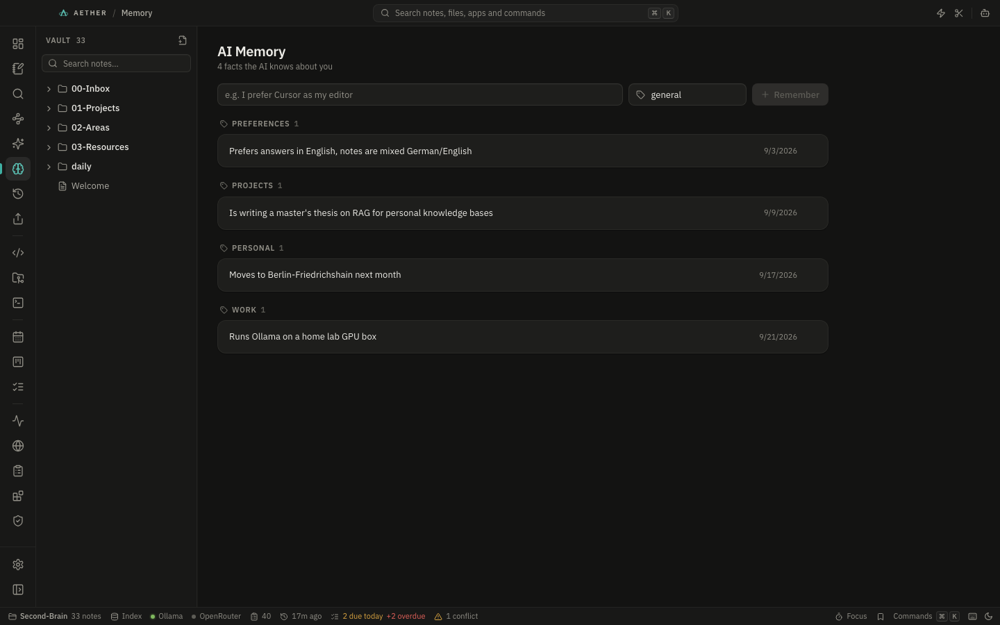

**What.** A small database of facts the agent always sees (⌘6), each with a category (`general`, `preferences`, `projects`, `people`, `work`, `personal`).

**Why.** Without memory every conversation starts from zero. "I write in TypeScript and Rust", "my thesis is due in March" — tell it once.

**How.** Type the fact, pick a category, press ↵. Or ask the agent: *"Remember that I prefer dark mode, category preferences."* Delete a fact with its trash icon. Facts are also searchable with the `@` prefix in the launcher.

---

## 10. History — every version of every note

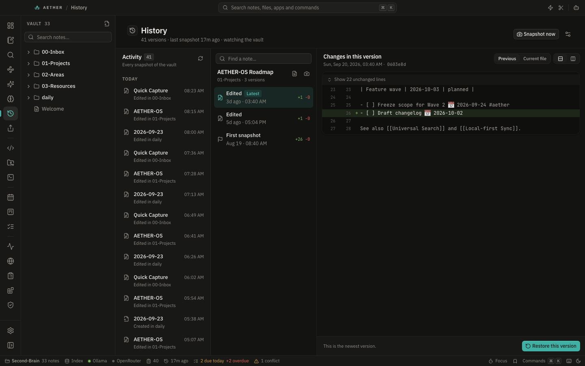

**What.** A Time Machine for the vault. Every note save becomes a commit in a local Git repository at `<vault>/.git` — automatically, no Git knowledge needed.

**Why.** Autosave is great until a bad find-and-replace, an accidental select-all, or an AI action rewrites a note. With versions, nothing written in AETHER-OS is lost. Because it is plain Git, the history also works outside the app (`git log`, any Git GUI, the IDE's Source Control).

**How.**

- **History view** (Knowledge group): **Activity** — every snapshot, grouped by day; **Versions** — the versions of one note with `+added −removed` counts (find another note at the top); **Changes** — the diff, unified or side by side, against the previous version or the current file.
- **Restore this version** writes the old content back and records it as a new `restore:` version, so a restore can itself be undone.
- **While editing**: ⇧⌘H opens the note's history in a drawer; restoring refreshes the editor.
- **Snapshot now**: ⌥⌘S commits every pending change immediately.
- **Status bar**: the clock shows the last snapshot ("2m ago"); a red dot means the last background snapshot failed.

**Under the hood.** A file watcher commits bursts of saves (2 s debounce) as one commit; a safety scan every 30 s catches files changed while the app was closed. Markdown notes and attachments (≤ 25 MB) are versioned; hidden folders and `.gitignore` rules are respected. An existing Git repository is used as is — AETHER-OS never touches remotes, branches or config. Turn it off in Settings → History.

---

## 11. Export & Publishing

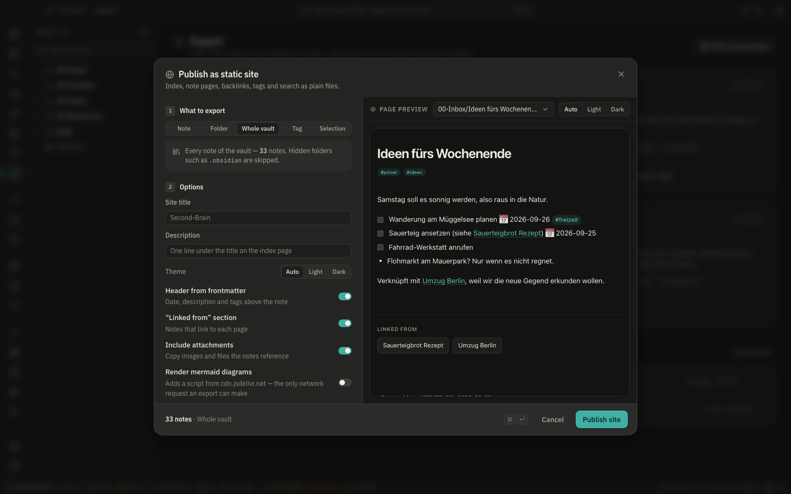

**What.** Four ways to get knowledge out of the vault, all generated on this machine:

| Flow | Output | Shortcut |
| --- | --- | --- |
| Single note | One self-contained `.html` (inlined styles and images, highlighted code, resolved links, tags, "Linked from") | ⇧⌘E |
| Print / PDF | The note through the system print dialog — choose *Save as PDF* | ⌥⌘P |
| Static site | Index, one page per note with backlinks, tag pages, client-side search, light/dark, `sitemap.xml`, optional `CNAME` — works from a folder or any static host | ⌥⌘W |
| Markdown bundle | A `.zip` with notes, referenced attachments and a manifest; wikilinks optionally converted to standard links | ⌥⌘Z |

**Why.** Sharing a note with a colleague, printing a report, publishing a digital garden, handing project notes to someone without Obsidian — locally, so your notes stay private until you decide where the files go.

**How.** Every wizard has three steps and a live preview: **What to export** (note, folder, whole vault, tag, or a selection), **Options** (theme, frontmatter header, backlinks, attachments, site title/description, public URL, custom domain, wikilink conversion), **Destination** (file or folder, native picker). ⌘↵ runs the export. The report lists pages, attachments and unresolved links, with *Open in browser* and *Reveal in Finder*. **Recent exports** on the Export view keep the last 25.

Raw HTML in notes is sanitised (no scripts, iframes or event handlers; app links such as `obsidian:` are dropped and `data:` URLs are kept only for images), notes with `publish: false` are skipped on sites, exports into the vault need an explicit confirmation, and a file export never replaces an existing file unless you confirm it. Mermaid diagrams are rendered only if you opt in (it loads `mermaid` from a CDN — the only network resource an export can reference).

---

## 12. IDE

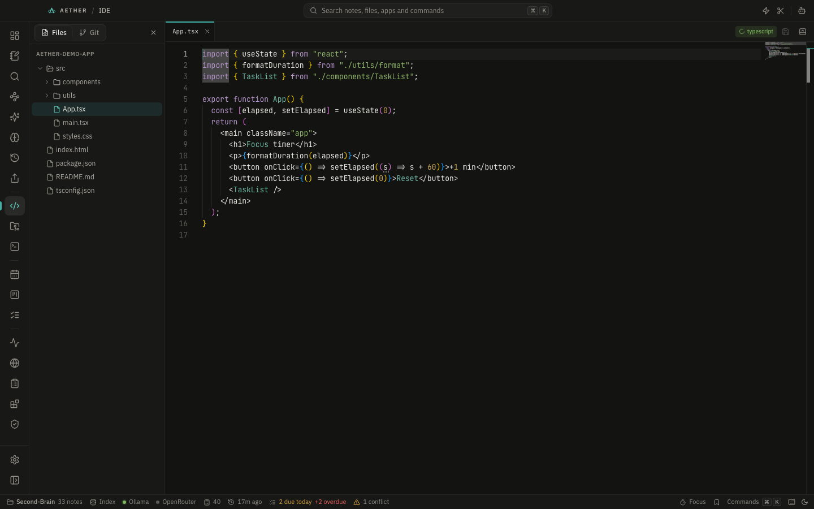

**What.** A code editor inside AETHER-OS (⌘7): Monaco, the editor of VS Code, bundled locally.

**Why.** No "VS Code for code and Obsidian for notes" — write the note about the bug, fix the bug, run the test, in one window.

**How.**

- **Open a project** from the picker (your project folders and the vault; the IDE can reach nothing else), from Projects, or from the launcher (↵ on a project or file).
- **Files** / **Git** tabs at the top of the sidebar. The file tree creates files and folders; files open in tabs.
- **Editor**: syntax highlighting, IntelliSense, multi-cursor, find/replace, go to definition. ⌘S saves.
- **Language servers** start on demand when a server is installed (`typescript-language-server`, `rust-analyzer`, `pyright`/`pylsp`, `vscode-json-language-server`): hover, completions, go-to-definition and diagnostics across the project. Without one, Monaco's built-in single-file features remain.
- **Source control**: branch switcher and creation, staged / unstaged changes, stage, unstage, discard, commit (⌘↵ in the message box), recent log, and a side-by-side diff (Esc closes).
- **Terminal panel**: the terminal button in the editor toolbar opens a PTY terminal at the project root; closing the panel keeps the session alive.

---

## 13. Projects

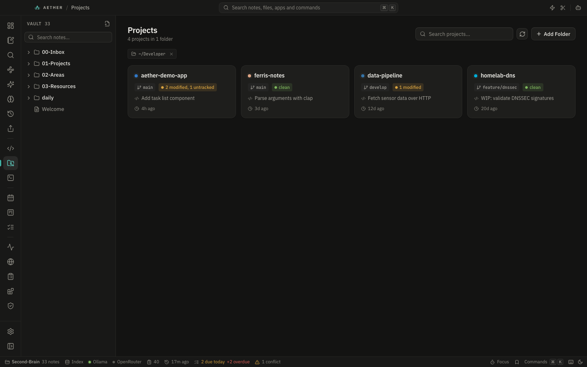

**What.** Every Git repository inside your project folders (⌘8), each card with branch, clean / modified / untracked counts, last commit message and age.

**Why.** Twelve repos across your disk? See at a glance which one is dirty and which you touched last — without `cd … && git status`.

**How.** **Add Folder** adds a folder to scan (it appears as a chip; × removes it — nothing is deleted from disk). Click a card to open the project in your external editor (Settings → Editor); right-click for *Open in Terminal* and *Open in Finder*. The same folders define what the IDE, the file search and the agent's `run_command` may reach.

---

## 14. Terminal

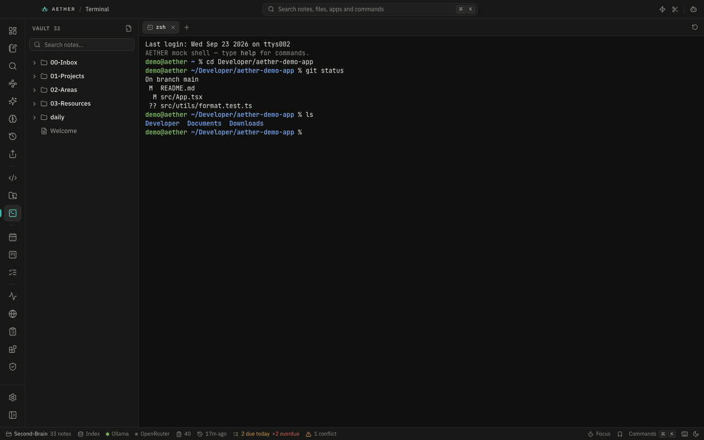

**What.** A real PTY shell (⌘9) — your login shell with your `PATH`, rendered by xterm.js. It runs `vim`, `htop`, `ssh`, anything.

**How.** `+` opens a tab (each tab is its own shell); × closes it; the reset button (top right) restarts a garbled session. Terminals keep running while you switch workspaces. The terminal follows the theme.

**Quitting with running terminals.** Closing the window or ⌘Q while sessions are running asks first ("2 terminal sessions are running — quit anyway?"). Press ⌘Q again within a few seconds to quit without the dialog, tick *Don't ask again*, or switch it off in Settings → General → *Confirm on quit with running terminals*.

---

## 15. Calendar

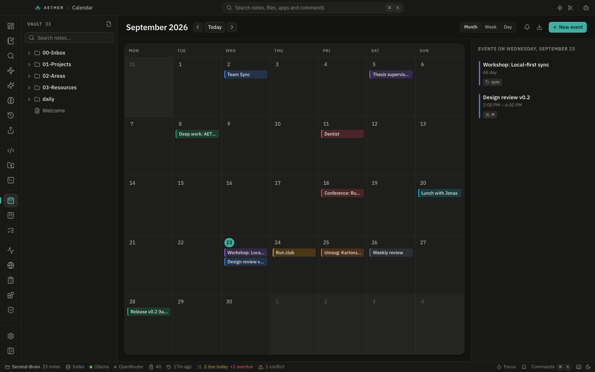

**What.** Month, week and day views of your events, with a list of the selected day on the right.

**Why.** Notes are spatial, work is temporal. The calendar puts deadlines next to the knowledge they belong to — and Home and the agent can read it.

**How.** **New event** (or Home → *Event*): title, all-day, start/end with live duration, due date, tags, attendees, location, Markdown description, one of eight colours. Click an event to edit or delete it. The bell sets reminder lead times (desktop notifications); the download icon imports and exports **ICS** (duplicates are recognised by UID). The agent can create and list events on its own and asks before changing or deleting them.

---

## 16. Tasks — project boards

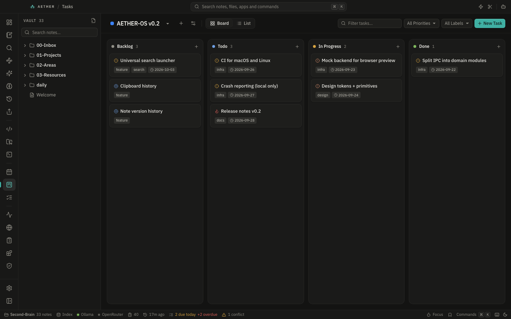

**What.** Projects with issue boards: columns Backlog · Todo · In Progress · Done, or a sortable list view. Tasks have status, priority, labels, checklists and due dates.

**Why.** Some work is a project, not a line in a note. Boards live in the app data folder, separate from your notes. (For checkboxes inside notes, see [Note Tasks](#17-note-tasks--checkboxes-from-every-note).)

**How.** Create a project (name + colour), add tasks inline at the bottom of a column, drag cards between columns, click a card for details. Search and filter by priority and label. Home lists tasks that are due; the agent can create tasks ("add a task to call the landlord" goes to an *Inbox* project if you name none).

---

## 17. Note Tasks — checkboxes from every note

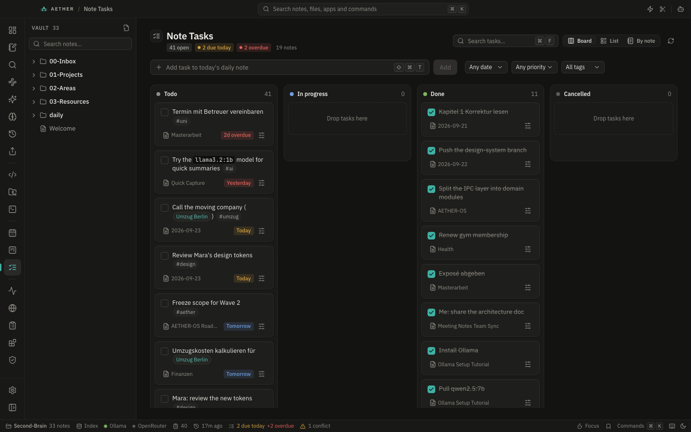

**What.** Every `- [ ]` / `- [x]` in every note becomes a task in one view (⌥⌘C), linked back to its note and line. Every change — ticking, moving on the board, due date, priority — is **written back into the Markdown**. The syntax is compatible with the Obsidian Tasks plugin.

**Why.** Tasks belong where the thinking happens — meeting notes, daily notes, project pages — but scattered checkboxes are easy to lose. Note Tasks makes them one list without moving them out of the notes.

**How.**

- **Layouts**: **Board** (Todo / In progress / Done / Cancelled — drag to change status), **List** (Overdue / Today / This week / Later / No date), **By note** (a group per note with progress). In the view: ⌥⌘1 / ⌥⌘2 / ⌥⌘3.
- **Filters**: due window, priority, tag, show completed; ⌘F searches text, note, tags and section.
- **Add**: the field at the top, or **⇧⌘T from anywhere**, appends a task to today's daily note.
- **Syntax**: due `📅 2026-09-30` or `due:2026-09-30`; priority `⏫ 🔼 🔽 🔺` or `!high`; tags `#tag`; status `[ ]` `[x]` `[/]` in progress `[-]` cancelled. Frontmatter and code blocks are ignored.
- **Open the note at the task**: the note link on a card opens the editor scrolled to that task and briefly highlights the line.
- **Safe edits**: only the task's own line changes. If the line changed on disk meanwhile, nothing is written and the view rescans (⌥⌘R rescans by hand).
- The status bar shows "N due today"; ⌘K → *Show tasks due today* / *Show overdue tasks*.

---

## 18. Monitor

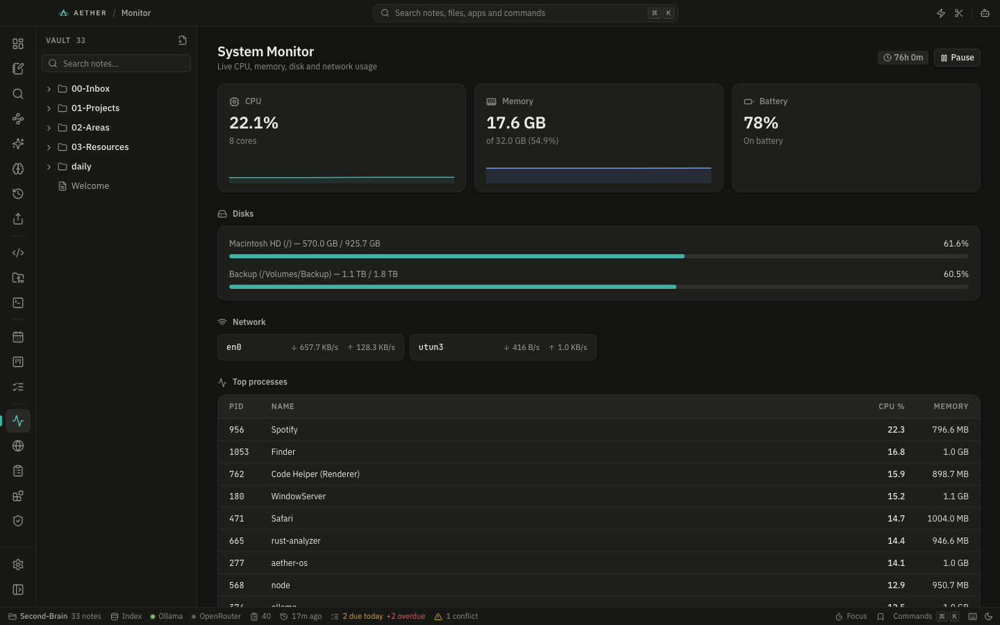

**What.** Live CPU, memory, battery, disks, network interfaces and the top processes, refreshed every second from Rust (`sysinfo`). *Pause* freezes the numbers.

**Why.** When Ollama eats your RAM or a Rust build pins the CPU, you see it without opening Activity Monitor — useful for choosing a model size that fits your machine.

---

## 19. Browser

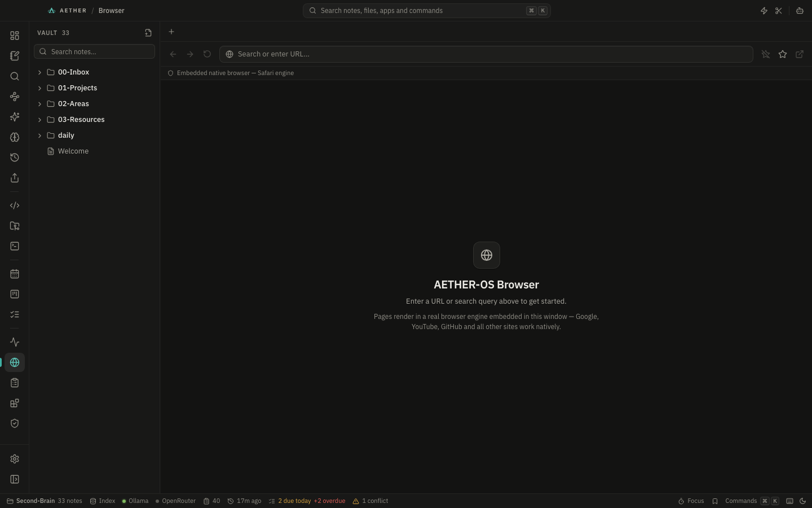

**What.** Real native webviews embedded in the window (WKWebView on macOS) — Google, YouTube, GitHub work as in Safari. Tabs, an address bar that also searches, back/forward/reload, bookmarks (star), and *open in the system browser*.

**How.** Type a URL or a search and press ↵. When a page is worth keeping, ⇧⌘C clips it into the vault ([§27](#27-web-clipper)). Bookmarks are also found by the launcher. In the browser preview (`dev:mock`) only the chrome is shown — pages need the desktop app.

---

## 20. Clipboard

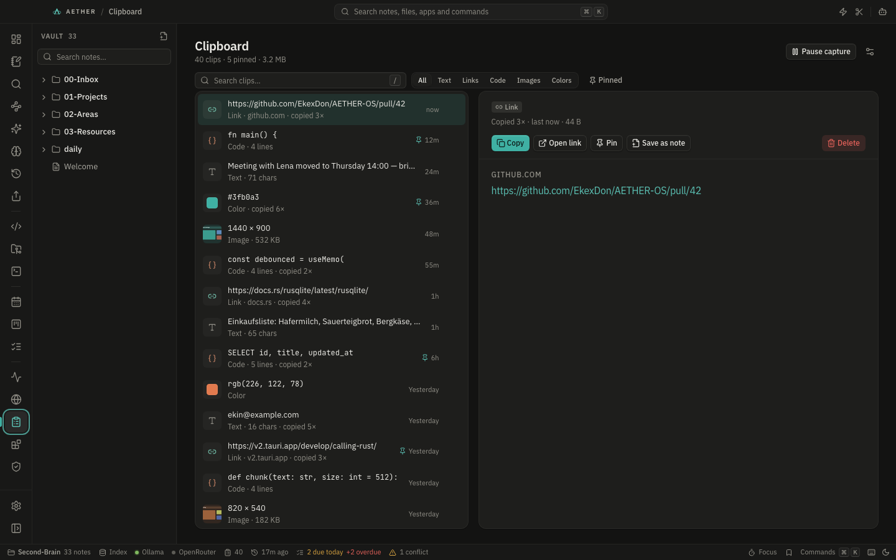

**What.** A system-wide clipboard manager (⇧⌘V). Everything you copy anywhere on the Mac — text, links, code, colours, images — is recorded locally, searchable, pinnable and one keystroke away from being copied again or saved as a note.

**Why.** Copied snippets are short-lived knowledge: a command, a link, a colour, a screenshot. Keeping them next to the vault makes them findable later — without a cloud service.

**How.**

| Key | Action |
| --- | --- |
| ⇧⌘V | Open the history (search focused) |
| ↑ / ↓, PageUp / PageDown | Move the selection |
| ↵ or double-click | Copy the clip back to the clipboard |
| P | Pin / unpin (pinned clips are never pruned) |
| ⌫ | Delete (Undo in the toast for 5 s) |
| / | Focus the search |

Filters: All · Text · Links · Code · Images · Colors, plus Pinned. The detail pane shows highlighted code, image previews, colour values (HEX / RGB / HSL) and *Open link*. **Save as note** creates `clipboard/<title>.md` (images go to `attachments/clipboard/`).

**Privacy.** Nothing leaves the machine. Likely secrets — API keys and tokens of well-known formats, JWTs, private keys, card numbers, long random strings — are **dropped before storage** (the view counts how many were skipped). *Pause capture* stops recording entirely; use it while you handle sensitive data. Settings → Clipboard: on/off, images, maximum clips (default 500), retention (default 30 days), clear history.

---

## 21. Plugins

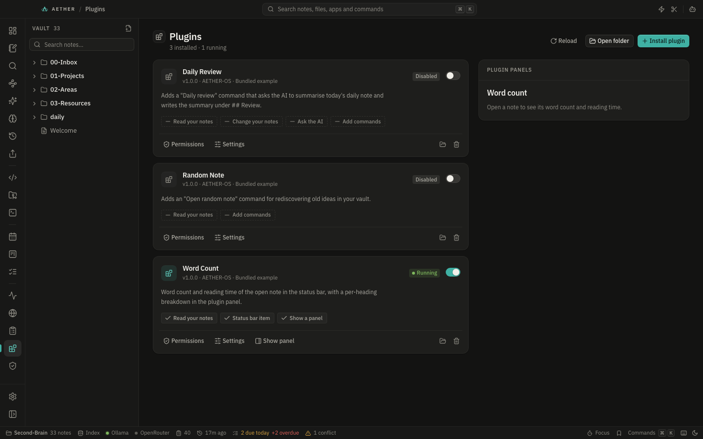

**What.** Small extensions that run sandboxed: each plugin is a folder with `manifest.json` and one JavaScript module, executed in its **own Web Worker** — no DOM, no direct access to files, network or the app's storage.

**Why.** Your own small automations (a word counter, a daily ritual, a link fetcher) without forking the app or trusting arbitrary code with your vault. What a plugin may do is visible, granted by you, and revocable.

**How.**

- **Install plugin** (⌥⇧⌘I) → choose a folder or `.zip`. Installing the same id again updates it.
- **Enable** with the switch; the first enable opens the **permission review** — one switch per requested permission with a plain-language description and risk label (read notes, change notes, create notes, commands, a panel, a status bar item, ask the AI, clipboard, HTTPS requests to named hosts). Permissions are checked in the app *and* again in Rust.
- **Settings** on a card are generated from the manifest; **Plugin panels** show a plugin's panel; plugin commands appear in ⌘K under *Plugins*.
- **Reload** (⌥⇧⌘R), **Open folder**, or uninstall with the trash icon (settings and plugin storage are removed; notes are untouched).

**Bundled examples** (disabled until you enable them): **Word Count** (status bar + per-heading panel), **Daily Review** (asks the AI to summarise today's daily note under `## Review`), **Random Note** (⌥⇧⌘O). Write your own: [`docs/PLUGIN-API.md`](PLUGIN-API.md).

---

## 22. Sync & Backup

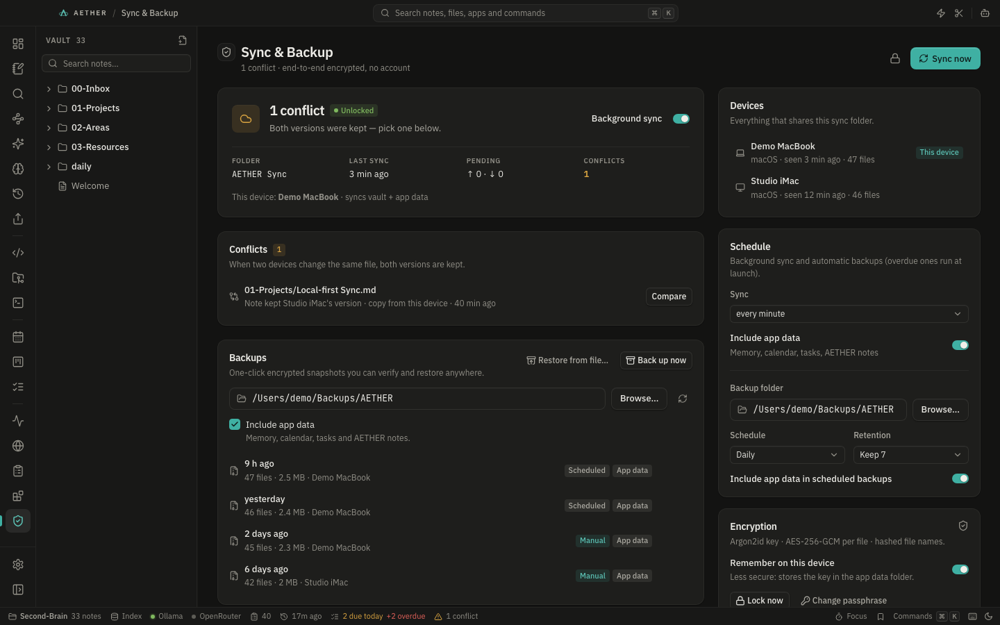

**What.** End-to-end encrypted sync of your vault — and optionally app data (memory, calendar, tasks, AI notes) — between devices **through any folder you already sync**: iCloud Drive, Dropbox, Syncthing, a NAS, a USB stick. Plus one-click encrypted backups.

**Why.** Your notes on every device without trusting a provider with their content. The sync tool becomes a dumb transport for unreadable blobs.

**What it is not.** There is **no relay server, no account and no mobile app**. Devices only meet in the shared folder, so sync is as fast as the tool that moves that folder. There is **no passphrase reset** — lose the passphrase and the synced data cannot be decrypted (your local vault is unaffected).

**How.**

1. **Set up sync** → choose the shared folder. AETHER-OS says whether it will *create* a new store or *join* an existing one.
2. Decide whether app data is included, then enter the passphrase (twice with a strength meter when creating; once when joining). *Remember on this device* stores the derived key (labelled "less secure"); by default you are asked once per app start.
3. The first sync runs immediately, then every minute (30 s … 1 h). On the next device: same folder, same passphrase.

**Conflicts.** If two devices changed the same file, the newer version keeps the path and the other is saved next to it as `Note (conflict from <device> <date>).md`. The conflict list opens a side-by-side diff: *Keep the note*, *Use the copy*, or *Keep both*. Edit beats delete; nothing is lost.

**Backups.** *Back up now* (⌥⇧⌘B) writes an `.aetherbak` archive to a folder of your choice — ideally an external drive. Backups can be **verified** (every file decrypted and hash-checked), **previewed** and **restored** as *Merge* (adds missing files, keeps differing ones side by side) or *Replace* (exact restore; the current folder is renamed, never deleted). Scheduled backups (every 6 h … weekly) have a retention limit; manual ones are never pruned.

**Keys.** ⌥⌘Y sync now · ⌥⌘L lock (forget the key) · ⌥⇧⌘B backup now. The status bar shows *Synced*, *Syncing n %*, *Locked*, *n conflicts* or *Sync error*.

**Crypto in one line.** Argon2id (64 MiB) turns the passphrase into a key; every object is AES-256-GCM with a fresh nonce; file names and contents are hidden behind keyed BLAKE3 hashes. Full model: [`docs/features/sync.md`](features/sync.md).

---

## 23. The AI agent — context, actions, approvals, compaction

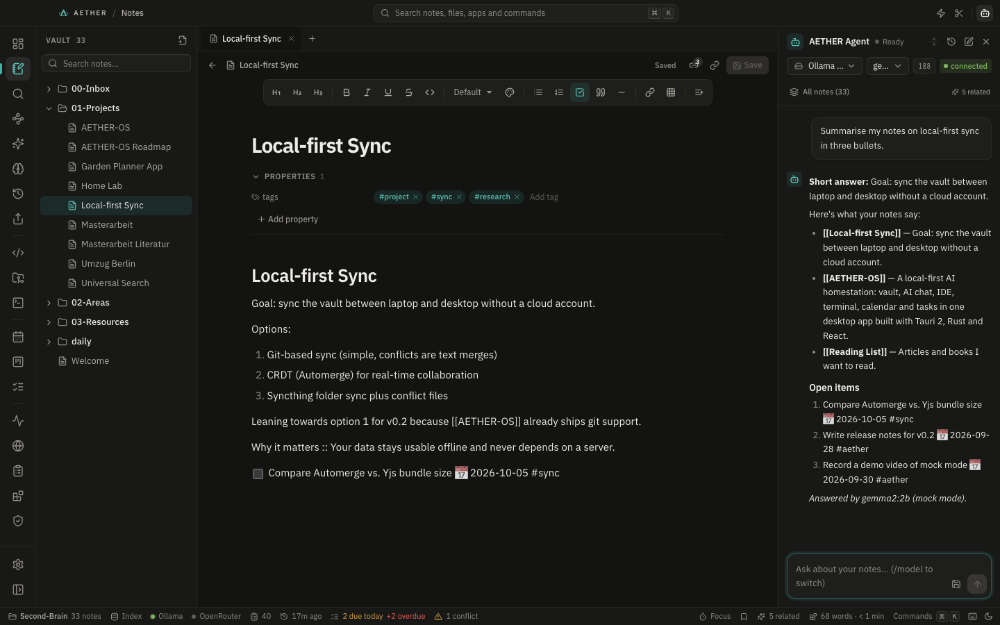

**What.** A streaming chat panel on the right (⌘J), available in every workspace, that answers from your notes and can take actions in the app.

### Providers and models

- **Engine bar**: provider (**Ollama · Local** or **OpenRouter · Cloud**), model, the **token meter** (size of the conversation window) and the connection state. Type `/model` in the input to switch models from the keyboard.
- **Ollama** runs on your Mac — free and private. **OpenRouter** gives access to Claude, GPT, Gemini, Qwen, Llama and more with one key (Settings → AI Providers; the key is stored in the app data folder, never in the webview or the vault). Prompts sent to a cloud model leave the machine — that is the only case.

### Context

- The **context bar** under the engine bar picks what the agent reads: **All notes**, a subset you select, or — with a note open — the **"N related" chip**: the open note plus its related notes. Memory facts are always included.
- Answers stream token by token; the save icon next to the input (**Save as AETHER Note**) keeps the latest answer in [AI Notes](#8-ai-notes). The header has *compact*, *history* (past sessions) and *new chat*.

### Actions and approvals

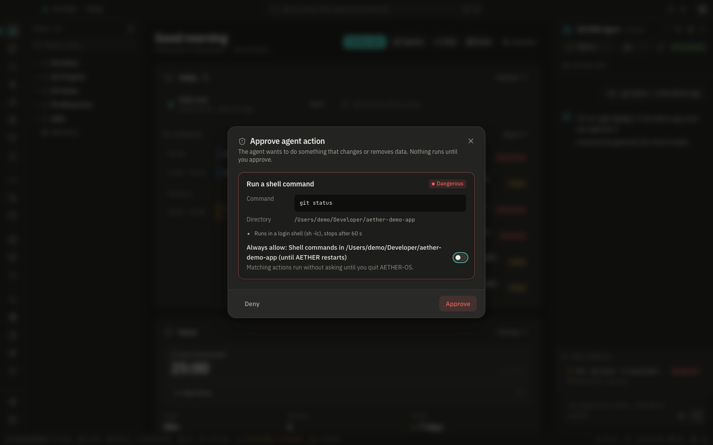

The agent can act, not just chat. Ask in plain words — *"create a note called Roadmap with these bullets"*, *"remember that …"*, *"add a task to call the landlord"*, *"run `git status` in the demo app"*.

| Risk | Actions | What happens |
| --- | --- | --- |
| Safe | create / append note, append to daily note, remember a fact, save an AI note, open or clip a URL, create or list calendar events, create a task | Runs immediately; a result card appears under the answer |
| Confirm | move a note, commit in a project, toggle a note task, update an event, import ICS | Stops at the **approval dialog** |
| Dangerous | run a shell command, delete a note, delete an event | Stops at the approval dialog with warnings |

The approval dialog shows exactly what will happen — the command and its resolved working directory, the note path, the files a commit would include, the task line that will flip — plus warnings for destructive commands (`rm -rf`, `sudo`, force pushes, `curl | sh` …). **Approve**, **Deny**, or with several pending **Approve all / Deny all**; Esc denies. *Always allow* creates a rule (commands are scoped to their directory): rules for confirm actions are remembered on this device, rules for dangerous actions last only until the app quits. Revoke rules in Settings → AI Intelligence.

Guard rails: `run_command` runs in a login shell with a minimal environment (`PATH`, `HOME`, `LANG`, `TERM` — no inherited API keys) and a 60 s timeout (configurable), only inside a project folder or the vault, output capped at 64 KB per stream; `delete_note` moves the note to `<vault>/.trash/`; `move_note` never overwrites. Every executed or denied action is recorded in the **agent activity** log (⌘K → *AI: show agent activity*).

Models follow the action format with varying reliability; the engine bar shows `tools: unreliable` for model families known to ignore it (`tinyllama`, `qwen:0.5b`, `stablelm`).

### Conversation memory (compaction)

The chat sends the conversation window with every question, so follow-ups work. When a chat grows past a threshold (default 6,000 estimated tokens; amber at 75 %), older messages are **compacted** into a structured summary — topic, facts, decisions, open questions, preferences — shown as a collapsible card at the top. If the model is offline, a local extractive summary is used (badge `fallback`). Compact by hand with the fold icon, a click on the token meter, or ⌘K → *AI: compact conversation*. The full transcript is always kept.

### Related notes and tags while writing

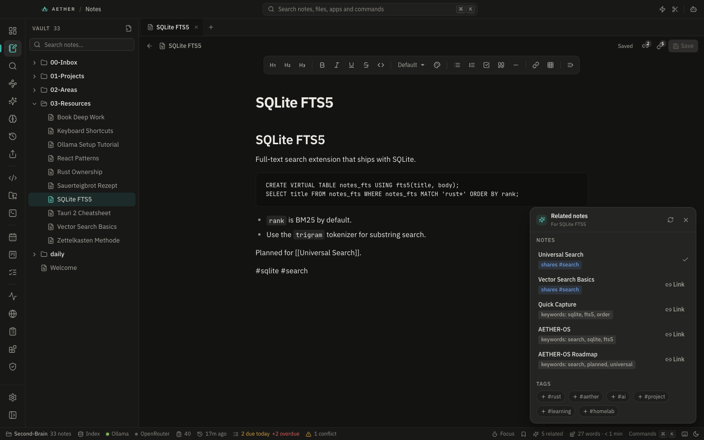

With a note open, the status bar shows **"N related"** a moment after you stop typing. ⇧⌘R opens the drawer: related notes with the reason (`semantic 0.82`, `shares #rust`, or `keywords: …`), a **Link** button that appends `[[Note]]`, and **tag chips** that add a tag to the frontmatter (or as `#tag`). Semantic matches need the vector index (status bar → *Index*); otherwise a keyword fallback is used.

---

## 24. Focus mode & Pomodoro

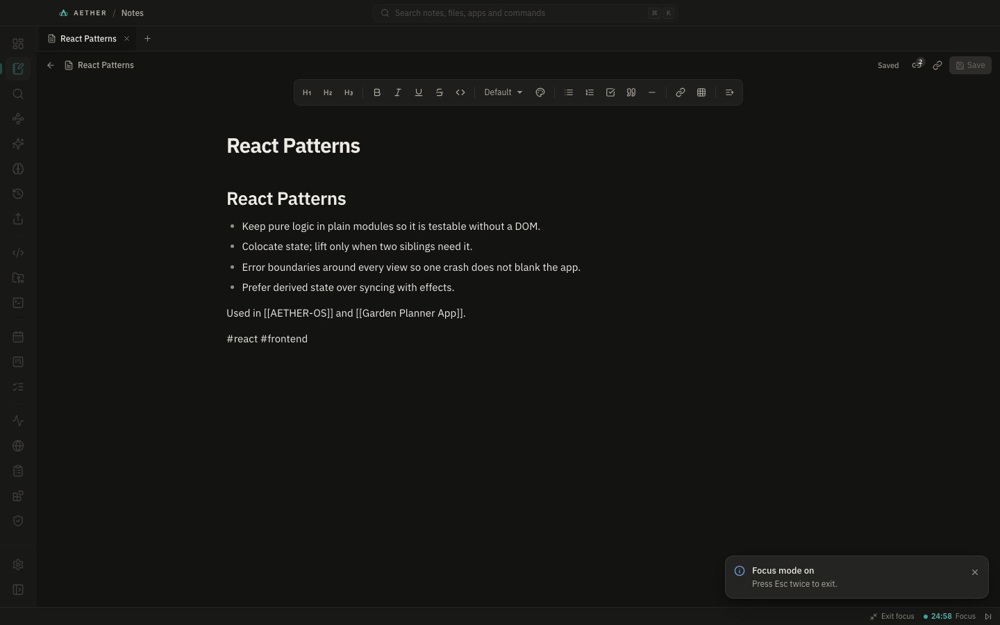

**What.** A Pomodoro timer in the status bar and a distraction-free Focus mode.

**Why.** Tools only help if you use them in long, quiet stretches. The timer builds the habit; the local focus log shows it accumulate — no account needed.

**How.**

- **⌥⌘T** (or *Focus* in the status bar, or *Start focus* on Home) starts a 25-minute work session; click the timer to pause/resume, the arrow skips a phase. After four sessions comes a long break. Breaks can start automatically; work always waits for you.
- The timer uses wall-clock time: a reload or restart continues exactly where it was. Sessions ≥ 1 minute are logged; Home shows today's minutes, sessions, your streak and a 7-day chart.
- **⇧⌘F** toggles **Focus mode**: the rail dims, sidebar, titlebar actions and most status items hide, the editor widens. **Esc twice** (or *Exit focus*) leaves.
- Settings → Focus & Pomodoro: durations, sessions before a long break, auto-start breaks, desktop notifications, sound.

---

## 25. Pins

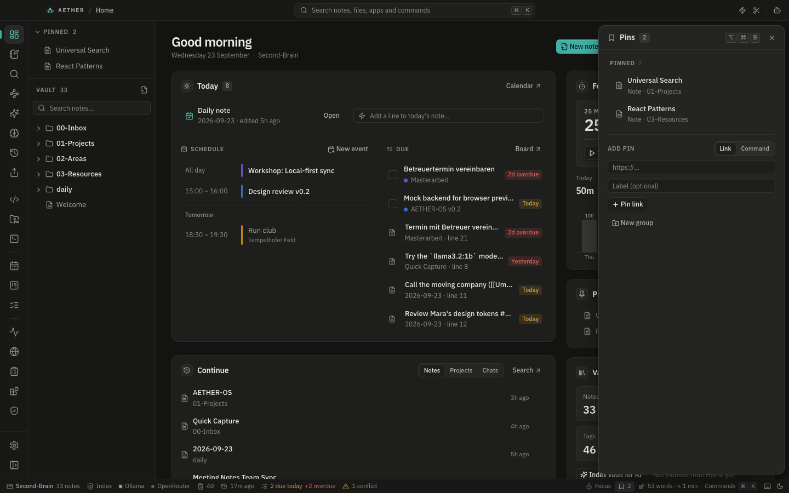

**What.** Bookmarks for the handful of things you open every day — notes, projects, commands, AI conversations and links — in named groups.

**How.**

- **Pin** the open note with **⇧⌘D**, use the pin button on any *Continue* row on Home, or add a link or a command in the drawer.
- **⌥⌘B** (or the bookmark icon in the status bar) opens the **pins drawer**; Home and the top of the vault sidebar show the same pins.
- **Open** with click or ↵ (note → editor, project → IDE, command → runs, conversation → agent panel, link → browser). **Reorder** by dragging or ⌥↑ / ⌥↓; ⌫ unpins (with Undo). Groups can be created, renamed and deleted in the drawer. Pins whose target disappeared are marked *Missing*.

---

## 26. Quick Capture

**What.** ⇧⌘N opens a one-line box anywhere in the app. Type, press ↵, and the thought is appended to **today's daily note** with a timestamp. Esc closes.

**Why.** Friction kills note-taking. Capture takes two seconds; sorting can happen later.

After saving, *Open note* jumps to the daily note. Quick Capture only appends, never overwrites. Home's *Today* block has the same capture field.

**Where the daily note lives.** By default `daily/YYYY-MM-DD.md`. Settings → Vault → *Daily notes* sets the folder and the file-name pattern, including sub-folders such as `YYYY/MM/YYYY-MM-DD`; Quick Capture, Home, ⇧⌘T and the agent's `append_daily` all follow it, and missing folders are created on demand.

---

## 27. Web Clipper

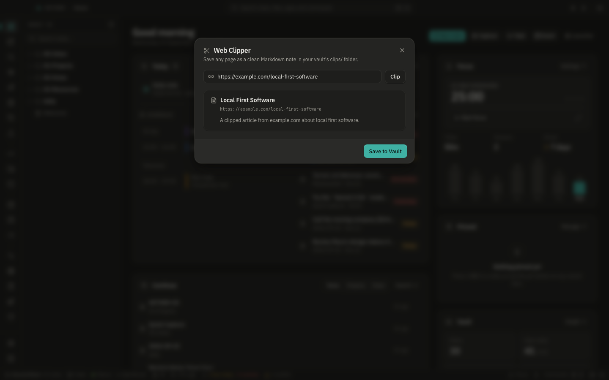

**What.** ⇧⌘C opens the clipper. Paste a URL, press **Clip**: the page is fetched in Rust, the main content extracted and converted to Markdown, and a preview shown. **Save to Vault** creates a note in `clips/` and opens it.

**Tips.** Best for articles and documentation; JavaScript-only pages may come out empty, and pages larger than 10 MB are refused. The source URL is kept in the note. The agent can clip too: *"clip https://… into my vault"*.

---

## 28. Settings

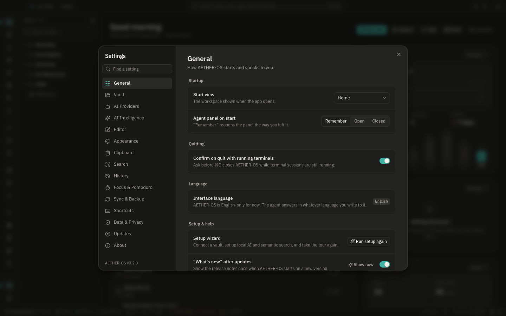

**What.** ⌘, (or the gear at the bottom of the rail) opens Settings as a modal with a searchable section list. Other features add their own sections.

| Section | What you set there |
| --- | --- |
| General | Start view, agent panel on start, confirm on quit with running terminals, interface language (English), run setup again, "What's new" after updates |
| Vault | Vault folder, status, reveal in Finder, create a starter vault, find existing vaults, daily-note folder and file-name pattern (sub-folders allowed, e.g. `YYYY/MM/YYYY-MM-DD`) |
| AI Providers | Default provider, Ollama connection and default model, download models by name, OpenRouter key (save / test / remove) and default cloud model, **embedding model** (any Ollama model; switching clears the vector index, so re-index afterwards), *Index vault* |
| AI Intelligence | Compaction (auto, threshold, messages kept), related-note suggestions, `run_command` timeout, "always allow" rules, agent activity log |
| Editor | Editor text size and line width, external editor for projects |
| Appearance | Theme, accent, density, rail labels |
| Clipboard | Recording, images, limits, retention, clear history |
| Search | Global launcher shortcut, what to search, file index folders, reindex, clear recents |
| History | Automatic versioning, snapshot now, repository info, open in IDE |
| Focus & Pomodoro | Durations, auto-start, notifications, sound |
| Sync & Backup | Folder, interval, scope, device name, backup schedule, lock / unlock, change passphrase |
| Shortcuts | Every command and editor shortcut, searchable; copy or save a Markdown cheat sheet |
| Data & Privacy | Where each kind of data lives (with sizes), what leaves the machine, crash reports, application log, reset app data |
| Updates | Installed version, check now, release notes, daily check |
| About | Version, links, open-source credits and licenses |

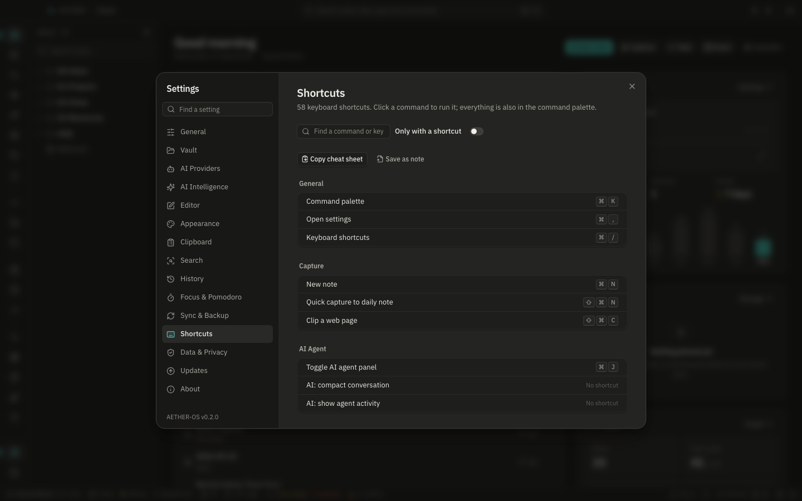

**Reset app data** (Data & Privacy) needs a checkbox and typing `RESET`. It moves the whole data folder aside to `<data folder>-backup-<timestamp>`, starts fresh (optionally keeping the vault connection) and restarts. Nothing is deleted, and the vault is never touched.

**Help commands** (⌘K → *Help*): run setup again, what's new, fix the local AI setup (Ollama), check for updates, copy the keyboard cheat sheet, data & privacy.

---

## 29. Keyboard shortcuts cheat-sheet

Generated from the command registry (`src/lib/commands/registry.ts`, the view registry and each feature's `commands.ts`). ⌘/ shows the same list in the app; Settings → Shortcuts can export it.

### Everywhere

| Shortcut | Action |
| --- | --- |
| ⌘K | Launcher / command palette |
| ⌥Space | Launcher from anywhere on the Mac (configurable) |
| ⌘P | Go to file |
| ⇧⌘P | Run a command |
| ⇧⌘K | Universal Search view |
| ⌘, | Settings |
| ⌘/ | Keyboard shortcuts overlay |
| ⌘J | Toggle the AI agent panel |
| ⌘N | New note |
| ⇧⌘N | Quick capture to the daily note |
| ⇧⌘C | Clip a web page |
| ⇧⌘T | Add a task to today's daily note |
| ⇧⌘V | Clipboard history |
| ⇧⌘L | Toggle light / dark theme |
| ⌘\ | Toggle navigation labels |

### Workspaces

| Shortcut | Workspace |
| --- | --- |
| ⌘1 … ⌘9 | Home · Notes · Search · Graph · AI Notes · Memory · IDE · Projects · Terminal |
| ⌥⌘C | Note Tasks |
| — | Calendar, Tasks, History, Export, Monitor, Browser, Clipboard (⇧⌘V), Plugins, Sync & Backup: ⌘K → "Go to …" |

### Notes, history, pins, focus

| Shortcut | Action |
| --- | --- |
| ⌘S / ⌘B / ⌘I / ⌘U | Save / bold / italic / underline (in the editor) |
| ⇧⌘R | Related notes (in the editor) |
| ⇧⌘H | Note history (drawer in the editor, otherwise the History view) |
| ⌥⌘S | Snapshot now |
| ⇧⌘D | Pin the current note |
| ⌥⌘B | Pins drawer |
| ⇧⌘F | Focus mode (Esc twice to leave) |
| ⌥⌘T | Start / pause Pomodoro |

### Export, sync, plugins

| Shortcut | Action |
| --- | --- |
| ⇧⌘E | Export current note as HTML |
| ⌥⌘P | Print / save as PDF |
| ⌥⌘W | Publish vault as a site |
| ⌥⌘Z | Bundle vault |
| ⌥⌘Y | Sync now |
| ⌥⌘L | Lock sync |
| ⌥⇧⌘B | Create a backup now |
| ⌥⇧⌘I | Install plugin |
| ⌥⇧⌘R | Reload plugins |
| ⌥⇧⌘O | Open random note (Random Note plugin, when enabled) |

### Inside views

| Where | Shortcut | Action |
| --- | --- | --- |
| Launcher | ↑ ↓ · Tab / ⇧Tab · ↵ · ⌘↵ · Esc | Select · next / previous section · open · open alternate · clear / close |
| Note Tasks | ⌥⌘1 / ⌥⌘2 / ⌥⌘3 · ⌘F · ⌥⌘R | Board / list / by note · search · rescan |
| Clipboard | ↵ · P · ⌫ · / | Copy · pin · delete · search |
| Pins | ↑ ↓ · ⌥↑ / ⌥↓ · ⌫ | Move focus · reorder · unpin |
| AI agent | ↵ · ⇧↵ · `/model` | Send · new line · switch model |
| IDE | ⌘S · ⌘↵ · Esc | Save · commit staged changes · close diff |
| Export wizard | ⌘↵ · Esc | Run the export · close |
| Setup wizard | ← → · ⌘↵ · Esc | Steps · continue · skip |
| Approval dialog | Esc | Deny everything pending |

Commands without a key binding (e.g. *Clipboard: pause / resume capture*, *AI: compact conversation*, *Search: reindex*, *History: toggle automatic versioning*, *Sync: unlock*, the Help commands) are one ⌘K away.

---

## 30. Where your data lives

`<app data>` = `~/Library/Application Support/com.ekin.aetheros/` on macOS.

| What | Where |
| --- | --- |
| Your notes (vault) | the folder you choose — plain `.md` files |
| Note versions | `<vault>/.git` |
| Trashed notes | `<vault>/.trash/` |
| Vault connection, project folders | `<app data>/config.json`, `project_dirs.json` |
| AI settings and OpenRouter key | `<app data>/ai/ai_config.json` |
| Embeddings | `<app data>/vectors/` |
| Memory facts, chat sessions | `<app data>/memory/` |
| AI Notes | `<app data>/aether/notes/` |
| Agent settings and audit log | `<app data>/intel/` |
| Calendar, task boards | `<app data>/calendar/`, `tasks/` |
| Note-task cache, focus log | `<app data>/vaulttasks/`, `focus/sessions.jsonl` |
| Clipboard history | `<app data>/clipboard/` |
| Search index | `<app data>/search/` |
| Plugins | `<app data>/plugins/` |
| Recent exports | `<app data>/export/` |
| Sync state | `<app data>/sync/` |
| Setup state, daily-note and general preferences | `<app data>/onboarding.json`, `vault_prefs.json`, `general_prefs.json` |
| Log and crash reports | `<app data>/logs/`, `crash-reports/` |
| UI preferences (theme, pins, layouts) | the webview's `localStorage` |

Settings → Data & Privacy shows these with sizes. **The vault is plain Markdown.** If AETHER-OS disappeared tomorrow, every note would still open in any text editor — with its full history in Git.

---

## 31. Power-user tips

1. **Morning routine.** Open Home, tick off what is done, start a Pomodoro (⌥⌘T), open the daily note from the Today block.
2. **Live in ⌘K.** Notes, files, apps, commands — and `>` to run any command by name. Use `#tag` and `@name` to narrow instantly.
3. **⌥Space is Spotlight.** Launch apps and jump into a note without switching to AETHER-OS first.
4. **Checkboxes are enough.** Write `- [ ] thing 📅 2026-10-01` in any note; Note Tasks, Home and the status bar pick it up.
5. **Let the agent do the chores** — and read the approval dialog. "Commit my changes in <project>", "move the Reading List note to the archive", "tick off the first task in Reading List".
6. **Compact on purpose.** Before switching topics in a long chat, compact it; the summary keeps decisions and open questions.
7. **Link with ⇧⌘R.** After writing a note, open related notes and link two or three; the graph and search get better every time.
8. **Pin your five.** Daily note, main project, the one command you run all the time, the chat you keep returning to.
9. **Snapshot before big edits.** ⌥⌘S, then refactor freely — History can always bring it back.
10. **Back up to a second disk.** Schedule a daily `.aetherbak` backup with a retention of 7; verify one now and then.

---

## 32. Troubleshooting

### "Ollama offline · fix" in the status bar

Click it: the guidance dialog shows the install and start commands (copyable) and a retry. Or run `ollama serve` in the Terminal and check `curl http://localhost:11434/api/tags`. "Model missing · fix" means Ollama runs but the selected model is not installed — download it from the dialog or Settings → AI Providers.

### The agent does not take actions

Small models often ignore the action format; the engine bar warns with `tools: unreliable`. Switch to `llama3.1`/`qwen2.5` or a cloud model with `/model`.

### Semantic search finds nothing

Build the index: status bar → *Index*, Home → *Index vault for AI*, or Settings → AI Providers → *Index vault*. It needs Ollama with the embedding model (default `nomic-embed-text`: `ollama pull nomic-embed-text`). If you changed the embedding model, the old index was cleared — index again. Keyword search in the launcher works without it.

### ⌥Space does not open the launcher

Another app owns the combination. Settings → Search shows why registration failed; pick another accelerator (e.g. `CommandOrControl+Shift+Space`).

### ⌘Q asks "terminal sessions are running — quit anyway?"

That is the quit confirmation. Quit, press ⌘Q again within a few seconds, or turn it off in Settings → General.

### A note looks wrong or an edit went bad

Open History (⇧⌘H in the editor), pick the last good version and *Restore this version*. The restore is itself a version, so it can be undone.

### A note task will not toggle ("This note changed on disk")

The line was edited elsewhere since the list was loaded. The view has rescanned — try again.

### Sync says *Locked* or asks for the passphrase

Sync keys live in memory only, so after every start you unlock once (⌘K → *Sync: unlock*), unless you enabled *Remember on this device*. After a passphrase change on another device, every device asks for the new one.

Errors say where they come from: `sync error: …` is about the folder or the transfer (for example "the sync folder is not reachable" — is the drive mounted, is iCloud/Dropbox running?), `crypto error: …` is about keys and data (for example "wrong passphrase", or "decryption failed: the data was modified or belongs to a different passphrase" for a file in the sync folder that fails its integrity check).

### A plugin shows *Failed*

The card shows the activation error; fix the plugin and press **Retry** or **Reload** (⌥⇧⌘R).

### The terminal is garbled

Press the reset button in the top right of the Terminal view.

### I want to start over

Settings → Data & Privacy → *Reset app data*. The data folder is moved aside (not deleted) and the vault stays untouched. To see the setup wizard again without resetting: ⌘K → *Help: run setup again*.

---

## You're done

You now know every corner of AETHER-OS. Write a note, press ⌘K, ask the agent something useful, and watch the graph fill up.
